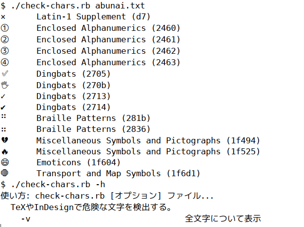

# check-chars

主に DTP（LaTeX や InDesign）向けに、UTF -8 で記述されたテキストファイルの文字のうち、フォントやソフトの観点から厄介になりそうな文字について一覧で情報を出力します。

## インストール

- Ruby：バージョン 2.3 以上での動作を確認していますが、Unicode の文字単位での分割をより正確に実行するために、その時点で最新のバージョンを使うことを推奨します。
- unicode-blocks.gem：`gem install unicode-blocks` でインストールしてください。
- check-chars.rb：適当にパスの通ったフォルダにコピーしてください。

## 使い方

UTF-8 で記述されたテキストファイルを用意し、`check-chars.rb` に渡します。

```
check-chars.rb ファイル名
```

ファイル中の文字の Unicode ブロックの種類を解析し、厄介なことになるかもしれない文字について、その文字、ブロック名、および Unicode コードポイントが示されます。



`-v` オプションを付けると、問題がないものも含めてすべての文字を一覧します。

```
check-chars.rb -v ファイル名
```

複数のファイルをまとめて渡したり、標準入力から渡すこともできます。

```
check-chars.rb *.txt
curl -s https://examle.com/ | check-chars.rb -v
```

## カスタマイズ
警告される Unicode ブロックは、check-chars.rb の `targetblocks_str` 変数に改行区切りで列挙しています。

ブロック名の詳細については、[Unicode::Blocks](https://github.com/janlelis/unicode-blocks) を参照してください。

## ライセンス
MIT ライセンスです。

```
Copyright (c) 2019 Kenshi Muto <kmuto@kmuto.jp>

Permission is hereby granted, free of charge, to any person obtaining
a copy of this software and associated documentation files (the
"Software"), to deal in the Software without restriction, including
without limitation the rights to use, copy, modify, merge, publish,
distribute, sublicense, and/or sell copies of the Software, and to
permit persons to whom the Software is furnished to do so, subject to
the following conditions:

The above copyright notice and this permission notice shall be
included in all copies or substantial portions of the Software.

THE SOFTWARE IS PROVIDED "AS IS", WITHOUT WARRANTY OF ANY KIND,
EXPRESS OR IMPLIED, INCLUDING BUT NOT LIMITED TO THE WARRANTIES OF
MERCHANTABILITY, FITNESS FOR A PARTICULAR PURPOSE AND
NONINFRINGEMENT. IN NO EVENT SHALL THE AUTHORS OR COPYRIGHT HOLDERS BE
LIABLE FOR ANY CLAIM, DAMAGES OR OTHER LIABILITY, WHETHER IN AN ACTION
OF CONTRACT, TORT OR OTHERWISE, ARISING FROM, OUT OF OR IN CONNECTION
WITH THE SOFTWARE OR THE USE OR OTHER DEALINGS IN THE SOFTWARE.
```
